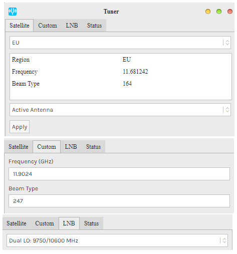

# OTHERNET acceso libre a datos desde el espacio
Resumiendo [OTHERNET](https://othernet.is/) es un servicio en torno a una emisión broadcast digital de datos desde satélites geostacionarios. 

Othernet provee a pequeños dispotivos locales o _hostpots_ de repositorios de datos metereológicos, noticias, Wikipedia, mensajes y archivos que pueden ser compartidos en el segmento terrestre. 

## Una larga historia
Inspirado en el proyecto [RACHEL](https://worldpossible.org/) que permite montar una plataforma autónoma de contenidos y formación como punto de acceso wifi allí donde no hay internet. [Syed Karim](https://www.linkedin.com/in/syedkarim1/) graduado en informática por la Universidad de Ilinois, replanteó a lo grande este concepto. ¿Y si los RACHEL se actualizan desde el espacio? Así podrían desvincularse de las redes terrestres, y por ende, estar en cualquier parte del mundo donde al menos un panel solar pueda darle energia. 

Y este concepto se materializó en **2015 en el proyecto Outernet** con su dispositivo _Lantern_ que abogaba por la libre información, la educación y el acceso un nivel básico de noticias en cualquier parte del mundo idependientemente de su localización, recursos o infraestructuras. Una primera aportación de la organización MDIF (Media Development Investment Fund) permitió construir un prototipo de receptor y un acuerdo con los operadores de los satélites Galaxy 19 y Hot Bird.

Y así fué como nació la campaña de _crowdfunding_ ["Latern: A Global Satellite Data Radio"](https://igg.me/at/outernet/x#/updates/all) en Indiegogo. Con un presupuesto de 390K$ acabó alcanzando los 573K$. Participé en esta primera ronda pero mi aportación se destinó a apadrinar un receptor (Lantern) para ser donado a un colegio en paises africanos. 

 
Privado entonces de tener un receptor, me apunté a una segunda ronda en la que había la posibilidad de tener un dispositivo DIY basado en un receptor de DVB-S2 (Geniatech Mygica HDStar) y una _single board computer_ como una Raspbery Pi. Pero de nuevo me quedé con las ganas porque nunca me funcionó. El clásico problema de incompatibilidad de versiones y la falta de soporte, frustó el intento.

Por otra parte ya **había pasado más de una año** tras completarse la campaña y el proyecto **se replantea el segmento espacial**. Habían pasado, de pensar en una constelación de micro-satélites propios en órbita baja (LEO) construidos por la empresa escocesa Clyde Space. A contratar un transpondedor en un satélite geostacionario. Finalmente llegaron a un acuerdo con ViaSat para el uso de un _beam_ que empezó con 20MB por día de _uplink_ desde el satélite SkyTerra-1 en banda L. Lo que garantizaba la recepción con antenas pequeñas. 

 
**En 2018 el proyecto se renombra a Othernet** y transita por una serie de diseños de receptor y acuerdos con otros proveedores de satélites. Hasta que en 2020 el proyecto se consolida como una empresa M2M en Chicago (Ilinois USA) con Syed Karim a la cabeza como CEO. Y define una solución más comercial y menos _maker_. Un modem-punto de acceso propio basado en arquitectura ARM con receptor de banda Ku y decodificación LoRa. Lo que da un ancho de banda de solo 20 Kbaudios pero suficiente para el tipo de contenidos que se manejan y teniendo en cuenta que el receptor tiene su propio sistema de archivos que es el que el usuario consume. Respecto a la cobertura global actual. Alcanza dos continentes gracias a estos geostacionarios:

- América del Norte que es proporcionado por el SES-2 en 87° Oeste
- Europa por el Astra 3B en 23.5° Este.

Y es **a finales de 2020 cuando me reengancho** al proyecto adquiriendo el receptor Dreamcatcher, reciclando una antena parabólica offset de 120 cm, poniendo todos mis conocimientos técnicos en marcha, y aprendiendo otros muchos, con el objetivo de hacer mi _primer contacto_.

## Cobertura
Viviendo en Europa me toca apuntar al Astra 3B. Para asegurarnos de la cobertura geográfica necesito saber el satélite y la banda que escucho: Ku. Con estos datos acudiremos a una aplicación que calcule el PIRE para nuestra localización como [SatBeams](https://www.satbeams.com/footprints). 

El PIRE es la Potencia Isotrópica Radiada Equivalente. Simplificando mucho, este dato nos indica la potencia con la que llega la señal. Por tanto, cuanto más bajo sea este dato, más débil es la potencia de la señal y, como consecuencia, mayor diámetro de parabólica necesitaremos. En mi localización la recomendación es de una parábola de 60cm para el haz “Europe Wide”. Yo estoy utilizando justo el doble por lo que la recepción no debería ser un problema.

## La antena
Aunque como hemos visto, Othernet no requiere un elemento receptor muy grande. Tengo interés en reutilizar la instalación para conexiones con otros satélites como el Es'hail 2 / QO-100 que necesitan más ganancia.
Y por esta razón acepté de buen gusto la donación de una maltratada antena offset de 120cm que pude transportar gracias a mi ´clásico´.

### Restauración y montaje

Tocó despiezar, desoxidar, enderezar y pintar. Y como suele pasar, algo se rompió por el camino. Precisamente una de las piezas más criticas, el tornillo de ajuste de elevación. Así que pusimos en marcha una iniciativa maker y gracias a mi amigo Toni Lupianez, tengo uno nuevo.
|Problema-solución|Implementación|
|---|---|
|||

Una vez completado el kit, el montaje no representa muchas dificultades y se puede completar en cinco sencillos pasos.
 
1. Una vez colocado el tope con dos tuercas laterales. Se ha podido fijar la abrazadera principal sobre el mástil con 4 tornillos de métrica 10 orientada longitudinalmente a la base a fin de proporcionar la máxima estabilidad.

2. Este modelo tiene tres pasadores que fijan la base de la parábola que atraviesan una estilo que sirve de indicador de elevación sobre un limbo graduado.

3. Seguidamente se fijan los pasadores en el otro extremo utilizando una platina que soportará el mecanismo de ajuste de elevación.

4. Antes de colocar la parábola es necesario tener el LNB y el soporte colocado ya que facilitará la posterior colocación.

5. Se coloca la parábola sobre 6 tornillos.

6. Y finalmente se hace el ajuste del punto focal donde deberá estar el LNB. Podemos ahorrarnos los cálculos utilizando esta página web: https://www.satsig.net/pointing/finding-dish-offset-angle.htm

### Orientación

Para orientar una antena parabólica acia un satélite geostacionario. Se necesitan 3 valores expresados en grados de ángulo:

- **Azimut**: ángulo horizontal respecto al Norte verdadero o geográfico en cuya vertial está el satélite posicionado.
- **Elevación**: ángulo vertical de la posición del satélite respecto a la línea del horizonte.
- **Polarización**: ángulo horario de captación de la señal respecto a la vertical. 

Hay muchas aplicaciones y páginas web para calcular estos parámetros de ajuste. Recomiendo [satlex](https://www.satlex.it/es/azel_calc.html) muy util para casos como este en el que no conecemos el ángulo de _offset_ de la parábola. 

En todo caso se pueden hacer los cálculos con dos fórmulas sencillas que nos serán útiles para ajustar la antena:

- **Angulo de _offset_ (O)** 
- - Offset = secante ( diámetro menor / diámetro mayor )
- - sec(120/130) = 22,62°
- **Angulo de respecto a la horizontal (H)**
- - H = 90 - ( E - O ) donde E es el ángulo de elevación: 39,48 en mi caso
- - 90-(39,48-22,62) = 73,14°

Utilizando la aplicación móvil [Satellite Finder](https://apps.apple.com/us/app/satellite-finder-pro/id1075788157#?platform=iphone). Confirmamos los datos obtenemos anteriormente y nos permite hacer los ajustes utilizando el compás y el inclinómetro de nuestro móvil que junto con la cámara nos despejará la duda de obstaculos entre el satélite y nuestra ubicación.
 
|Ajuste elevación|Ajuste azimut|
|---|---|
|||

## Hardware
La [web oficial](https://othernet.is/products/dreamcatcher-v3-05) sigue ofreciendo el _Dreamcatcher v3.05 Data Radio Kit_ aunque advierte que se va a deprecar por lo que su **precio está rebajado a 49$**. Advierto que es una compra en USA por lo que al precio final habrá que sumarle gastos de envio y tasas de aduana.

|Dreamcatcher v3.0|LNB|
|---|---|
|||
|Procesador a 1 GHz ARM|LNB 13V/18V bias tee|
|256 MB RAM|Entrada: 10,7-12,75GHz|
|Adaptador WiFi USB|L.O.:9,75/10.6GHz|
|Dos adaptadores microSD slots uno para contenidos|Ruido: 0,3dB (Typ.)|
|LEDs para recepción de paquetes, heartbeat, y alimentación|Ganancia: 60dB(Typ)|
|TCXO 2.5 PPM high precision||
|Botón para resetear wifi en modo AP||
|Tamaño 12 x 11.7 cm ||

### Resultado

## Software
Si queremos que el dispositivo Dreamcatcher reciba mensajes de Othernet tendremos que cargar en una tarjeta micro-SSD la imagen del Skylark, que no es más que un Linux Debian adaptado a ARM con una aplicación adaptade de RACHEL. La última versión la podemos descargar de: https://archive.othernet.is/Dreamcatcher3%20Skylark/ También he dejado en este repositorio la que yo he utilizado incluyendo la [guía de usuario](https://github.com/McOrts/OTHERNET_GroundStation/blob/main/docs/DreamcatcherV3.05.pdf) donde explica detalladamente los pasos para la instalación y configuración.

Resumiendo, el dispositivo crea un punto de acceso wifi sin credenciales desde el que accederemos a una aplicación web en la URL 10.0.0.1. Una vez dentro, las opciones propias para una instalación en Europa están dentro de la configuración de Tuner en la pestaña de Satellite.
 
Finalmente si toda la instalación ha sido correcta. Desde el icono de Log Viewer tendremos un checklist todo a OK en la pestaña de diagnosticos tal cual así:

## Primer contacto
Si todo ha ido más o menos bien. Empezaremos a recibir paquetes. Si no lo tenemos todo bien ajustado, nos encontraremos paquetes erroneos. Hay un mínimo de PER (Packet Error Rate) para que el proceso que interpreta los paquetes de datos pueda transformarlo en ficheros válidos.
 
La **relación Señal/Ruido** (SNR) debe entrar en el rango de -14 dB a +10 dB en el mejor de los casos
El valor de **Lock** a 'yes'
El **RSSI** indicador de potencia de señal (Received Signal Strength Indicator) fluctuará entre los valores de -60 y -100 dBm.
Cuando tengamos perfectamente ajustada la recepción, deberíamos tener un 100% de paquetes válidos y alcancar un **alcho de banda** de 10,000 baudios (bps).

## Acceso a mi instalación
Fiel al propio espíritu del proyecto he querido dar acceso libre a mi instalación. Para que se puedas ver de primera mano qué tipo de mensajes se reciben, la aplicación de previsión metereológica o navegar por wikipedia. He abierto un acceso web público donde podrás entrar con la siguiente credencial:

- Usuario: gest
- Password: gest

Solo necesitas un navegador y podrás acceder a OTHERNET desde tu dispositivo con acceso a la información en tiempo real que tenga actualizada en mi Dreamcatcher:

### Mapa de _Ground Stations_
Tras algunas tareas administrativas como la conexión a la red local, cambio de password de administración y NAT de puertos para el acceso fuera de nuestra red. Ya tendremos todo preparado.
 
El backoffice de sistema ofrece un mapa on-line de las estaciones activas en el mundo. Parece que somos 3 en España aunque el número varia a consecuencia de desconexiones de mantenimiento:
https://status.othernet.is/
