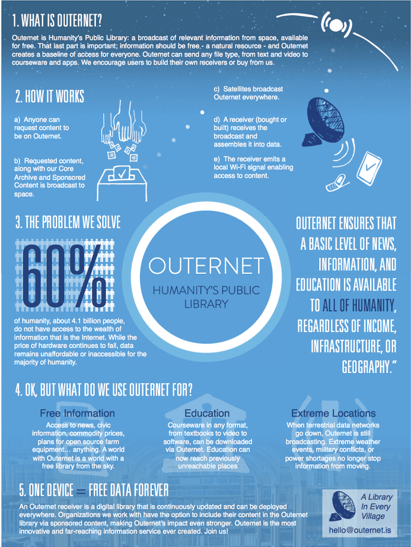

# OTHERNET acceso libre a datos desde el espacio
Resumiendo [OTHERNET](https://othernet.is/) es un servicio en torno a una emisión broadcast digital de datos desde satélites geostacionarios. 

Othernet provee a pequeños dispotivos locales o _hostpots_ de repositorios de datos metereológicos, noticias, Wikipedia, mensajes y archivos que pueden ser compartidos en el segmento terrestre. 

## Una larga historia
Inspirado en el proyecto [RACHEL](https://worldpossible.org/) que permite montar una plataforma autónoma de contenidos y formación como punto de acceso wifi allí donde no hay internet. [Syed Karim](https://www.linkedin.com/in/syedkarim1/) graduado en informática por la Universidad de Ilinois, replanteó a lo grande este concepto. ¿Y si los RACHEL se actualizan desde el espacio? Así podrían desvincularse de las redes terrestres, y por ende, estar en cualquier parte del mundo donde al menos un panel solar pueda darle energia. 

Y este concepto se materializó en **2015 en el proyecto Outernet** con su dispositivo _Lantern_ que abogaba por la libre información, la educación y el acceso un nivel básico de noticias en cualquier parte del mundo idependientemente de su localización, recursos o infraestructuras. Una primera aportación de la organización MDIF (Media Development Investment Fund) permitió construir un prototipo de receptor y un acuerdo con los operadores de los satélites Galaxy 19 y Hot Bird.

Y así fué como nació la campaña de _crowdfunding_ ["Latern: A Global Satellite Data Radio"](https://igg.me/at/outernet/x#/updates/all) en Indiegogo. Con un presupuesto de 390K$ acabó alcanzando los 573K$. Participé en esta primera ronda pero mi aportación se destinó a apadrinar un receptor (Lantern) para ser donado a un colegio en paises africanos. 

 
Privado entonces de tener un receptor, me apunté a una segunda ronda en la que había la posibilidad de tener un dispositivo DIY basado en un receptor de DVB-S2 (Geniatech Mygica HDStar) y una _single board computer_ como una Raspbery Pi. Pero de nuevo me quedé con las ganas porque nunca me funcionó. El clásico problema de incompatibilidad de versiones y la falta de soporte, frustó el intento.

Por otra parte ya **había pasado más de una año** tras completarse la campaña y el proyecto **se replantea el segmento espacial**. Habían pasado, de pensar en una constelación de micro-satélites propios en órbita baja (LEO) construidos por la empresa escocesa Clyde Space. A contratar un transpondedor en un satélite geostacionario. Finalmente llegaron a un acuerdo con ViaSat para el uso de un _beam_ que empezó con 20MB por día de _uplink_ desde el satélite SkyTerra-1 en banda L. Lo que garantizaba la recepción con antenas pequeñas. 

 
**En 2018 el proyecto se renombra a Othernet** y transita por una serie de diseños de receptor y acuerdos con otros proveedores de satélites. Hasta que en 2020 el proyecto se consolida como una empresa M2M en Chicago (Ilinois USA) con Syed Karim a la cabeza como CEO. Y define una solución más comercial y menos _maker_. Un modem-punto de acceso propio basado en arquitectura ARM con receptor de banda Ku y decodificación LoRa. Lo que da un ancho de banda de solo 20 Kbaudios pero suficiente para el tipo de contenidos que se manejan y teniendo en cuenta, que el receptor tiene su propio sistema de archivos que es el que el usuario consume. Respecto a la cobertura. Se recibe la transmisión en banda Ku por dos geostacionarios:

- América del Norte que es proporcionado por el SES-2 en 87° Oeste
- Europa por el Astra 3B en 23.5° Este.

Y es **a finales de 2020 cuando me reengancho** al proyecto adquiriendo el receptor Dreamcatcher, reciclando una antena parabólica offset de 120 cm, poniendo todos mis conocimientos técnicos en marcha, y aprendiendo otros muchos, con el objetivo de hacer mi _primer contacto_.

## Cobertura
Viviendo en Europa me toca apuntar al Astra 3B. Para asegurarnos de la covertura geográfica necesito saber el satélite y la banda que escucho: Ku. Con estos datos acudiremos a una aplicación que calcule el PIRE para nuestra localización como [SatBeams](https://www.satbeams.com/footprints). 

El PIRE es la Potencia Isotrópica Radiada Equivalente. Simplificando mucho, este dato nos indica la potencia con la que llega la señal. Por tanto, cuanto más bajo sea este dato, más débil es la potencia de la señal y, como consecuencia, mayor diámetro de parabólica necesitaremos. En mi localización la recomendación es de una parábola de 60cm y yo estoy utilizando justo el doble. Lo que debería mejorar la recepción.

